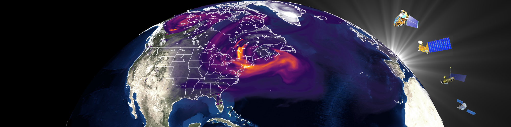

# GEOS-CF-API

CFAPI is a RESTful API that allows users to access GEOS-CF model forecasts and historical estimates.

Documentation for using the API via URL and curl requests can be found [here.](https://fluid.nccs.nasa.gov/cfapi/docs/)

This repository also contains a jupyter notebook that shows some examples for accessing and plotting a GEOS-CF forecast by requesting information from CFAPI.
